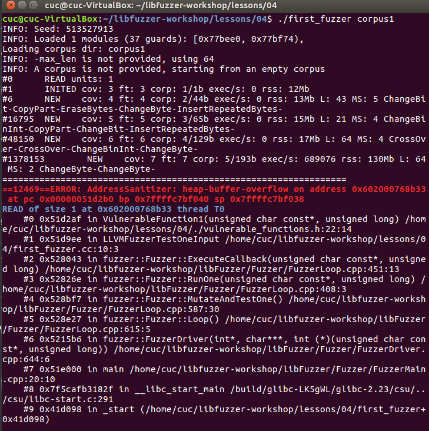
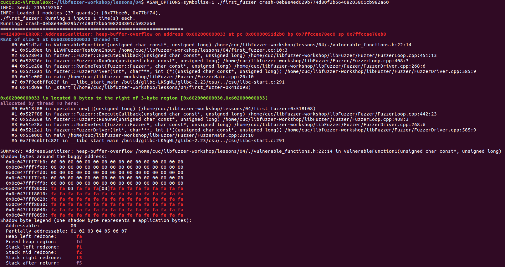
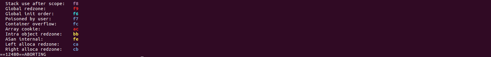
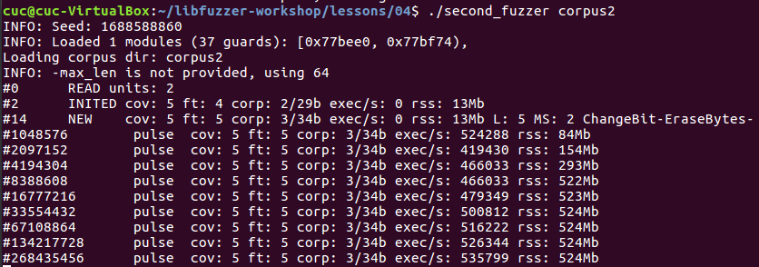
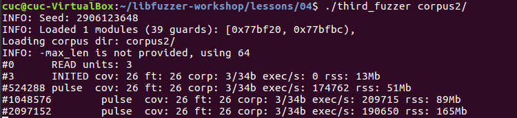
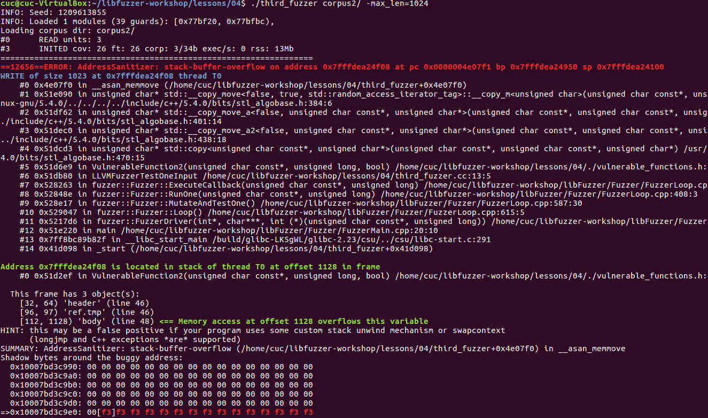
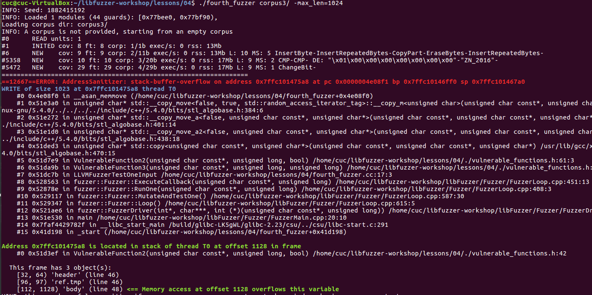
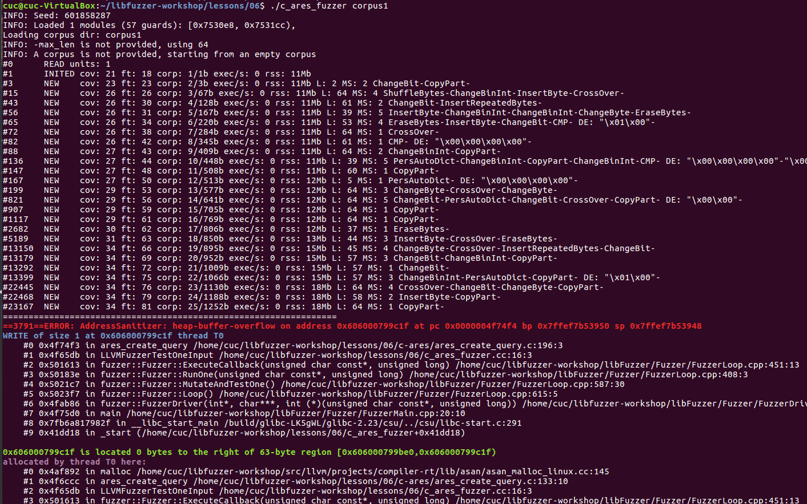

# 模糊测试
## 相关知识
### 定义
* 模糊测试是一种通过向程序提供随机输入来查找导致崩溃的测试用例来发现软件中的错误的自动化的技术，对程序进行模糊测试可以快速了解其整体稳健性。

* 通过向应用提供非预期的输入并监控输出中的异常来发现软件中的故障(faults)的方法”，模糊测试利用自动化或是半自动化的方法重复地向应用提供输入。

### 分类
* 基于变异的模糊测试
  * 根据已知数据样本通过变异的方法生成新的测试用例
  * 基于变异的fuzzer是通过变异已知的测试用例来创建新的测试用例。常见的变异技术包括位翻转，即将输入中的随机位进行翻转，或移动、删除、重复输入中的数据块。一个基于变异的fuzzer的主要优点是它需要较少的worker来设置。基于变异的fuzzer的关键部分是选择有趣的测试用例进行变异。这些测试用例需要尽可能不同，使模糊测试达到尽可能多的代码覆盖率，使其更有可能发现bug。例如，如果目标是一个查看和编辑图片的应用程序，并且所选择的测试用例只是 PNG 格式的，那么fuzzer就不太可能覆盖到处理其他文件类型的代码。

* 基于生成的模糊测试
  * 根据已知的协议或接口规范进行建模，生成测试用例
  * 基于生成的fuzzer会从头开始生成新的测试用例。基于生成的fuzzer需要知道输入文件的结构，否则它们只会生成随机的字节。通常它们需要worker来进行设置，并且专门用于特定的输入类型。 然而，一旦启动并运行之后，它们往往能比基于变异的fuzzer产生更多的代码覆盖率，因此更有可能发现不同的bug。

### 模糊测试各阶段
1. 确定测试目标
2. 确定输入向量
3. 生成模糊测试数据
4. 执行模糊测试数据
5. 监视异常
6. 判定发现的漏洞是否可能被利用

### 模糊测试方法
* 预生成测试用例：理解规约，生成测试边界条件或是违反规约的测试用例。
* 随机生成输入：简单地向目标应用发送伪随机数据。
* 手工协议变异测试：测试者就是模糊测试器。
* 变异或强制性测试：从一个有效的协议样本或是数据格式开始，持续不断地打乱数据包或是文件中的每一个字节、字、双字或是字符串。
* 自动协议生成测试：理解协议规约或文件定义，创建文法，识别出数据包或文件中的动态和静态部分，动态部分可以被模糊化变量替代。

### 模糊测试器类型
* 本地模糊器
  * 命令行模糊测试器
  * 环境变量模糊测试器
  * 文件格式模糊测试器
* 远程模糊测试器
  * 网络协议模糊测试器
  * Web应用模糊测试器
  * Web浏览器模糊测试器
* 内存模糊测试器
* 网络协议模糊测试：
  * 简单协议：仅有简单认证或没有认证，通常基于可打印的ASCII字符而不是二进制数据；
  * 复杂协议：通常由二进制数据和偶尔包含人可读的ASCII字符串构成，认证可能通过加密或是某种形式的混淆来实现。（SPIKE、Peach模糊测试框架）

### 模糊测试器的结构
为了有效地运行，模糊器需要执行许多重要任务:

* Generate test cases  
  * 生成测试用例
* Record test cases or any information needed to reproduce them 
  * 记录测试用例或重现它们所需的任何信息
* Interface with the target program to provide test cases as input
  * 与目标程序的接口提供测试用例作为输入 
* Detect crashes
  * 检测崩溃 
* Fuzzers often split many of these tasks out into separate modules, for example having one library that can mutate data or generate it based on a definition and another to provide test cases to the target program and so on.
  * 功能分块 

### 测试用例生成
生成测试用例将取决于是使用基于突变还是基于生成的模糊测试。无论是哪种，都需要随机转换，无论是特定类型的字段还是任意数据块。这些转换可以是完全随机的，但值得记住的是，边缘和角落的情况通常可能是程序中的错误来源。

* Very long or completely blank strings 
  * 非常长的或空字符串 
* Maximum and minimum values for integers on the platform 
  * 整数的最大值和最小值 
* Values like -1, 0, 1 and 2
  * -1,0,1,2 
* 特殊字符:
  * Null characters 空字符
  * New line characters 换行符
  * Semi-colons 分号
  * Format string values (%n, %s, etc.) 格式化字符串值
  * Application specific keywords 应用特定关键字

## LibFuzzer
### 简介
* LibFuzzer是一个in-process，coverage-guided，evolutionary模糊测试引擎，是LLVM项目的一部分。LibFuzzer和要被测试的库链接在一起，通过一个特殊的模糊测试进入点（目标函数），用测试用例feed要被测试的库。fuzzer会跟踪哪些代码区域已经测试过，然后在输入数据的语料库上产生变异，来最大化代码覆盖。代码覆盖的信息由LLVM的SanitizerCoverage插桩提供。
* 模糊测试种类：
  * Generation Based：通过对目标协议或文件格式建模的方法，从零开始产生测试用例，没有先前的状态
  * Mutation Based：基于一些规则，从已有的数据样本或存在的状态变异而来
  * Evolutionary：产生或变异或两者都有，In-process有代码覆盖反馈

### 安装
* 环境
  * VirtualBox+Ubuntu16.04 x64
* 安装依赖
```bash
# 更新源
sudo apt-get update

# libfuzz
sudo apt-get install -y make autoconf automake libtool pkg-config zlib1g-dev
git clone https://github.com/Dor1s/libfuzzer-workshop.git
# 安装clang 使用checkout_build_install_llvm.sh脚本
cd libfuzzer-workshop/
sh checkout_build_install_llvm.sh
# 构建
cd libfuzzer-workshop/libFuzzer
Fuzzer/build.sh

# 配置符号链接
sudo ln -s /usr/bin/clang-6.0 /usr/bin/clang
sudo ln -s /usr/bin/clang++-6.0 /usr/bin/clang++
```
## 编写Fuzzer
### Fuzzer1
考虑如下这个函数：
```c++
bool VulnerableFunction1(const uint8_t* data, size_t size) {
  bool result = false;
  if (size >= 3) {
    result = data[0] == 'F' &&
             data[1] == 'U' &&
             data[2] == 'Z' &&
             data[3] == 'Z';
  }
  return result;
}
```
用下面的fuzz target来测试它：
```c++
#include <stdint.h>
#include <stddef.h>
#include "vulnerable_functions.h"
extern "C" int LLVMFuzzerTestOneInput(const uint8_t *data, size_t size) {
    VulnerableFunction1(data, size);
    return 0;
}
```
编译Fuzzer
```c++
clang++ -g -std=c++11 -fsanitize=address -fsanitize-coverage=trace-pc-guard \
first_fuzzer.cc ../../libFuzzer/libFuzzer.a \
-o first_fuzzer
```
创建一个新目录来存放语料库，运行Fuzzer
```bash
mkdir corpus1
./first_fuzzer corpus1

# 输出
```


fuzzer1发现了堆缓冲区漏洞，尝试重现崩溃，为了获得符号化栈跟踪，添加选项：
```bash
./first_fuzzer crash-0eb8e4ed029b774d80f2b66408203801cb982a60 

ASAN_OPTIONS=symbolize=1 ./first_fuzzer crash-0eb8e4ed029b774d80f2b66408203801cb982a60 
```
获得符号化结果如下





### Fuzzer2
考虑如下函数：
```c++
constexpr auto kMagicHeader = "ZN_2016";
constexpr std::size_t kMaxPacketLen = 1024;
constexpr std::size_t kMaxBodyLength = 1024 - sizeof(kMagicHeader);

bool VulnerableFunction2(const uint8_t* data, size_t size, bool verify_hash) {
  if (size < sizeof(kMagicHeader))
    return false;

  std::string header(reinterpret_cast<const char*>(data), sizeof(kMagicHeader));

  std::array<uint8_t, kMaxBodyLength> body;

  if (strcmp(kMagicHeader, header.c_str()))
    return false;

  auto target_hash = data[--size];

  if (size > kMaxPacketLen)
    return false;

  if (!verify_hash)
    return true;

  std::copy(data, data + size, body.data());
  auto real_hash = DummyHash(body);
  return real_hash == target_hash;
}
```
用下面的fuzz target来测试它(与Fuzzer1)相同
```c++
#include <stdint.h>
#include <stddef.h>
#include "vulnerable_functions.h"
extern "C" int LLVMFuzzerTestOneInput(const uint8_t *data, size_t size) {
    VulnerableFunction1(data, size);
    return 0;
}
```

编译Fuzzer
```c++
clang++ -g -std=c++11 -fsanitize=address -fsanitize-coverage=trace-pc-guard \
    second_fuzzer.cc ../../libFuzzer/libFuzzer.a \
    -o second_fuzzer
```
运行Fuzzer
```bash
mkdir corpus2
./second_fuzzer corpus2

# 输出
```


输出没有发现崩溃，重新修改fuzz target，为verify_hash目标API的参数使用不同的值
```c++
#include "vulnerable_functions.h"

extern "C" int LLVMFuzzerTestOneInput(const uint8_t *data, size_t size) {
  bool verify_hash_flags[] = { false, true };

  for (auto flag : verify_hash_flags)
    VulnerableFunction2(data, size, flag);
  return 0;
}
```
编译fuzzer
```bash
clang++ -g -std=c++11 -fsanitize=address -fsanitize-coverage=trace-pc-guard \
    third_fuzzer.cc ../../libFuzzer/libFuzzer.a \
    -o third_fuzzer
```
运行fuzzer
```bash
./third_fuzzer corpus2/
# 输出
```


发现了一条新的信息```INFO: -max_len is not provided, using 64``` ，而分析目标中的ZN_2016可能达到```constexpr std::size_t kMaxPacketLen = 1024;``` 所以添加参数如下：
```bash
./third_fuzzer corpus2/ -max_len=1024

# 输出
```


发现在```vulnerable_functions.h:61:3```存在一个栈缓冲区溢出漏洞。

### Fuzzer3
考虑如下函数：
```c++
constexpr std::size_t kZn2016VerifyHashFlag = 0x0001000;

bool VulnerableFunction3(const uint8_t* data, size_t size, std::size_t flags) {
  bool verify_hash = flags & kZn2016VerifyHashFlag;
  return VulnerableFunction2(data, size, verify_hash);
}
```
实际上这只是前面函数的一个wrapper，但是关键点是这里有一个大的flags取值范围。列举fuzzer中所有可能的组合不太现实，而且也不能保证新的可能值不会再添加进来。这种情况，可以借助libFuzzer提供的data来取一些flags的随机值：
```c++
#include "vulnerable_functions.h"

#include <functional>
#include <string>

extern "C" int LLVMFuzzerTestOneInput(const uint8_t *data, size_t size) {
  std::string data_string(reinterpret_cast<const char*>(data), size);
  auto data_hash = std::hash<std::string>()(data_string);

  std::size_t flags = static_cast<size_t>(data_hash);
  VulnerableFunction3(data, size, flags);
  return 0;
}
```
编译fuzzer
```bash
clang++ -g -std=c++11 -fsanitize=address -fsanitize-coverage=trace-pc-guard \
    fourth_fuzzer.cc ../../libFuzzer/libFuzzer.a \
    -o fourth_fuzzer
```
运行fuzzer
```bash
mkdir corpus3
./fourth_fuzzer corpus3/ -max_len=1024
# 输出
```


发现了相同的崩溃，但是现在fuzzer对于flags的值来说是通用的了。

## Heartbleed Vulnerable(CVE-2014-0160)
### 漏洞原理
* 2014年4月8日，互联网上曝出了严重一个漏洞称为Heartbleed，该漏洞由安全公司Codenomicon和谷歌安全工程师发现。Heartbleed漏洞，造成许任何人在互联网上阅读系统的内存保护脆弱的OpenSSL的软件版本。 这种妥协密钥用于识别服务提供者和加密流量,用户名和密码的和实际的内容。 这允许攻击者窃听通信、窃取数据直接从服务和用户和模拟服务和用户。

* 2014年4月7日OpenSSL发布了安全公告，在OpenSSL1.0.1版本中存在严重漏洞（CVE-2014-0160），此次漏洞问题存在于ssl/dl_both.c文件中。OpenSSL在实现TLS和DTLS的心跳处理逻辑时，存在编码缺陷。OpenSSL的心跳处理逻辑没有检测心跳包中的长度字段是否和后续的数据字段相符合，攻击者可以利用这点，构造异常的数据包，来获取心跳数据所在的内存区域的后续数据。这些数据中可能包含了证书私钥、用户名、用户密码、用户邮箱等敏感信息。该漏洞允许攻击者，从内存中读取多达64KB的数据。

* TLS位于传输层和应用层之间，提供数据安全加密。TLS心跳指的是用户向服务器发送数据包，服务器返回一个相同的数据包以确定彼此在线，以支持持续通信功能。用户向服务器发送的心跳数据中用两个字节表明有效负载数据长度，而服务器端OpenSSL将根据这个有效负载长度构造一个新的数据包会送给对端。服务器端得到数据包，数据包长度为plen_real，而数据包中包含一个字节表明有效负载数据长度plen_fake，数据包剩下的部分是有效负载数据，长度为plen_real-1。整个数据包存储在一个char型数组之中。而服务器端构造新数据包时，先分配一段plen_fake+1的内存空间，前两个字节存放plen_fake，之后使用memcpy从收到的数据包有效负载数据起始位置向新数据包拷贝plen_fake字节数据。正常情况下plen_fake = plen_real-1，当用户有意设置plen_fake大于实际有效负载长度plen_real-1时，服务器就会发送plen_fake长度的数据，其中包括plen_fake - plen_real-1长度的数据，这些数据可能是一些用户密码或者密钥。

* 常见场景
  * 使用了openssl扩展库加密的网络协议
  * https
  * SSL VPN
  * 邮件服务器

### Fuzz

构建有漏洞的openssl版本
```bash
tar xzf openssl1.0.1f.tgz
cd openssl1.0.1f/

./config
make clean
make CC="clang -O2 -fno-omit-frame-pointer -g -fsanitize=address -fsanitize-coverage=trace-pc-guard,trace-cmp,trace-gep,trace-div" -j$(nproc)
```
实现fuzzer，fuzzer中用到了刚刚编译的openssl产生的库文件，代码中的API都是openssl库中的
```c++
#include <openssl/ssl.h>
#include <openssl/err.h>
#include <assert.h>
#include <stdint.h>
#include <stddef.h>

#ifndef CERT_PATH
#define CERT_PATH
#endif

SSL_CTX *Init() {
  SSL_library_init();
  SSL_load_error_strings();
  ERR_load_BIO_strings();
  OpenSSL_add_all_algorithms();
  SSL_CTX *sctx;
  assert (sctx = SSL_CTX_new(TLSv1_method()));
  /* These two file were created with this command:
      openssl req -x509 -newkey rsa:512 -keyout server.key \
     -out server.pem -days 9999 -nodes -subj /CN=a/
  */
  assert(SSL_CTX_use_certificate_file(sctx, CERT_PATH "server.pem",
                                      SSL_FILETYPE_PEM));
  assert(SSL_CTX_use_PrivateKey_file(sctx, CERT_PATH "server.key",
                                     SSL_FILETYPE_PEM));
  return sctx;
}

extern "C" int LLVMFuzzerTestOneInput(const uint8_t *data, size_t size) {
  static SSL_CTX *sctx = Init();
  SSL *server = SSL_new(sctx);
  BIO *sinbio = BIO_new(BIO_s_mem());
  BIO *soutbio = BIO_new(BIO_s_mem());
  SSL_set_bio(server, sinbio, soutbio);
  SSL_set_accept_state(server);
  BIO_write(sinbio, data, size);
  SSL_do_handshake(server);
  SSL_free(server);
  return 0;
}
```
编译fuzzer
```bash
cd ..
clang++ -g openssl_fuzzer.cc -O2 -fno-omit-frame-pointer -fsanitize=address \
    -fsanitize-coverage=trace-pc-guard,trace-cmp,trace-gep,trace-div \
    -Iopenssl1.0.1f/include openssl1.0.1f/libssl.a openssl1.0.1f/libcrypto.a \
    ../../libFuzzer/libFuzzer.a -o openssl_fuzzer
```

运行fuzzer
```bash
mkdir corpus1
./openssl_fuzzer ./corpus1/

# 输出
INFO: Seed: 3620533608
INFO: Loaded 1 modules (88608 guards): [0xcad4c0, 0xd03d40), 
Loading corpus dir: ./corpus1/
INFO: -max_len is not provided, using 64
INFO: A corpus is not provided, starting from an empty corpus
#0  READ units: 1
#1  INITED cov: 1473 ft: 385 corp: 1/1b exec/s: 0 rss: 31Mb
#2  NEW    cov: 1479 ft: 414 corp: 2/36b exec/s: 0 rss: 31Mb L: 35 MS: 1 InsertRepeatedBytes-
#111  NEW    cov: 1479 ft: 417 corp: 3/79b exec/s: 0 rss: 36Mb L: 43 MS: 5 ShuffleBytes-CrossOver-CMP-EraseBytes-EraseBytes- DE: "\x00\x00"-
#2256 NEW    cov: 1490 ft: 439 corp: 4/128b exec/s: 0 rss: 127Mb L: 49 MS: 5 PersAutoDict-ChangeBit-ChangeBinInt-ChangeBinInt-InsertRepeatedBytes- DE: "\x00\x00"-

<...>

#120643 NEW    cov: 1563 ft: 721 corp: 37/1736b exec/s: 24128 rss: 373Mb L: 46 MS: 2 CopyPart-CMP- DE: "\x00\x00\x00\x00\x00\x00\x00v"-
#121008 NEW    cov: 1565 ft: 723 corp: 38/1758b exec/s: 24201 rss: 373Mb L: 22 MS: 2 ChangeBinInt-EraseBytes-
=================================================================
==32104==ERROR: AddressSanitizer: heap-buffer-overflow on address 0x629000009748 at pc 0x0000004aad87 bp 0x7fff9266d020 sp 0x7fff9266c7d0
READ of size 25344 at 0x629000009748 thread T0
    #0 0x4aad86 in __asan_memcpy (/usr/local/google/home/mmoroz/Projects/libfuzzer-workshop/lessons/HB/openssl_fuzzer+0x4aad86)
    #1 0x4ff232 in tls1_process_heartbeat /usr/local/google/home/mmoroz/Projects/libfuzzer-workshop/lessons/HB/openssl1.0.1f/ssl/t1_lib.c:2586:3
    #2 0x580be0 in ssl3_read_bytes /usr/local/google/home/mmoroz/Projects/libfuzzer-workshop/lessons/HB/openssl1.0.1f/ssl/s3_pkt.c:1092:4
    #3 0x585c37 in ssl3_get_message /usr/local/google/home/mmoroz/Projects/libfuzzer-workshop/lessons/HB/openssl1.0.1f/ssl/s3_both.c:457:7
    #4 0x548a54 in ssl3_get_client_hello /usr/local/google/home/mmoroz/Projects/libfuzzer-workshop/lessons/HB/openssl1.0.1f/ssl/s3_srvr.c:941:4
    #5 0x544a4e in ssl3_accept /usr/local/google/home/mmoroz/Projects/libfuzzer-workshop/lessons/HB/openssl1.0.1f/ssl/s3_srvr.c:357:9
```

如输出所示，tls1_process_heartbeat函数中发生了heap-buffer-overflow。

## c-ares(CVE-2016-5180)
### 漏洞原理
* c-ares是一个用于异步执行DNS请求和名称解析的C库。c-ares1.12.0之前的1.x版本中的‘ares_create_query’函数存在基于堆的缓冲区溢出漏洞。远程攻击者可借助特制的主机名利用该漏洞造成拒绝服务（越边界写入）或执行任意代码。

### Fuzz
构建有漏洞的c-ares版本
```bash
tar xzvf c-ares.tgz
cd c-ares

./buildconf
./configure CC="clang -O2 -fno-omit-frame-pointer -g -fsanitize=address -fsanitize-coverage=trace-pc-guard,trace-cmp,trace-gep,trace-div"
make CFLAGS=
```
实现fuzzer
```c++
#include <ares.h>

extern "C" int LLVMFuzzerTestOneInput(const uint8_t *data, size_t size) {
  unsigned char *buf;
  int buflen;
  std::string s(reinterpret_cast<const char *>(data), size);
  ares_create_query(s.c_str(), ns_c_in, ns_t_a, 0x1234, 0, &buf, &buflen, 0);
  ares_free_string(buf);
  return 0;
}
```
编译fuzzer
```bash
cd ..
clang++ -g c_ares_fuzzer.cc -O2 -fno-omit-frame-pointer -fsanitize=address \
    -fsanitize-coverage=trace-pc-guard,trace-cmp,trace-gep,trace-div \
    -Ic-ares c-ares/.libs/libcares.a \
    ../../libFuzzer/libFuzzer.a -o c_ares_fuzzer
```
运行fuzzer
```bash
mkdir corpus1
./c_ares_fuzzer corpus1

# 输出
```


[此外，模糊测试也是渗透测试中的一种常用的技术手段，对渗透测试也学习了一点。](https://github.com/LeLeF/Metasploit/blob/master/exp01/%E6%B8%97%E9%80%8F%E6%B5%8B%E8%AF%95.md)

## 参考
*《模糊测试 强制发掘安全漏洞的利器》
* https://www.mwrinfosecurity.com/our-thinking/15-minute-guide-to-fuzzing/
* https://4hou.win/wordpress/?p=19493
* [libfuzzer-workshop/lessons](https://github.com/Dor1s/libfuzzer-workshop/tree/master/lessons)
* [fuzzer-test-suite](https://github.com/google/fuzzer-test-suite)