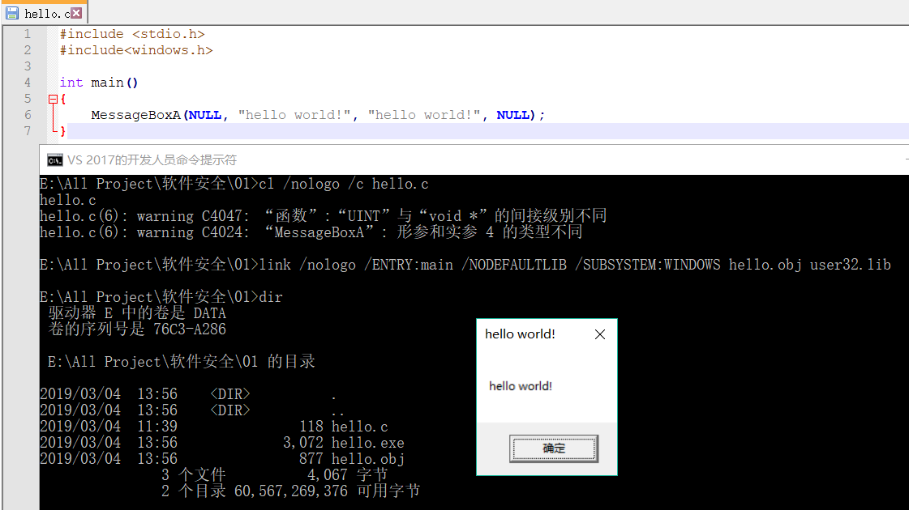
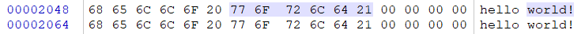
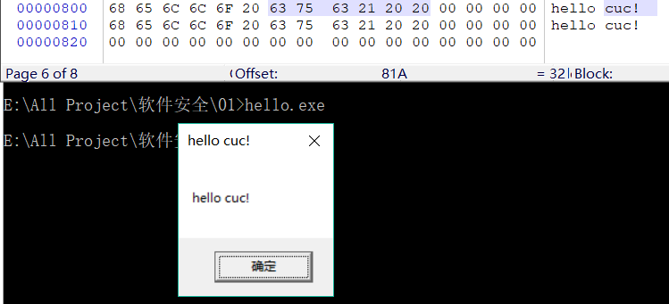

# 实验01
题目：编写一个release版本的 hello world 程序。通过修改程序可执行文件的方式（不是修改源代码），使得程序运行后显示的内容不为hello world，变成 hello cuc！

# 
1. 编写hello.c文件，使用MessageBoxA显示“hello world！”
2. 手动编译、链接，使得到的.exe文件尽量小。
3. 编译命令：```cl /nologo /c /O1 hello.c```
<br>链接命令：```link /nologo /ENTRY:main /NODEFAULTLIB /SUBSYSTEM:WINDOWS hello.obj user32.lib```
4. 运行hello.exe文件



5. 在Winhex中查找到“hello world！”，修改为“hello cuc！”，保存 后运行新的hello.exe显示为“hello cuc！”
  

