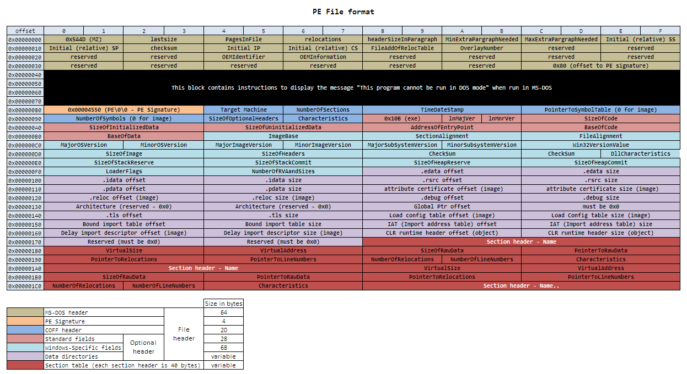
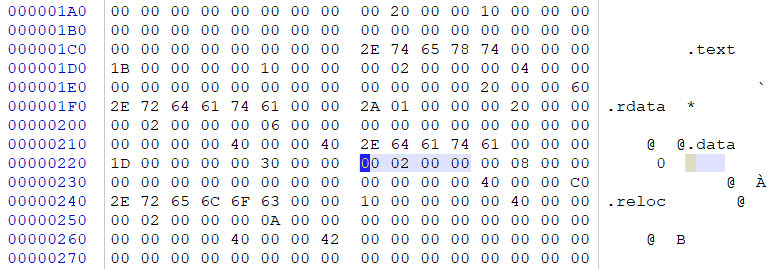
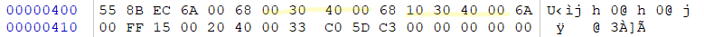
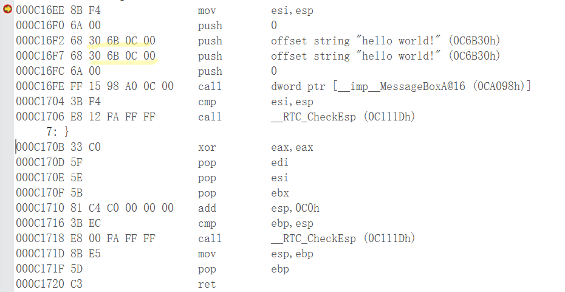
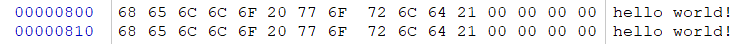
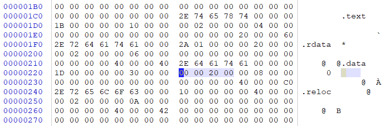
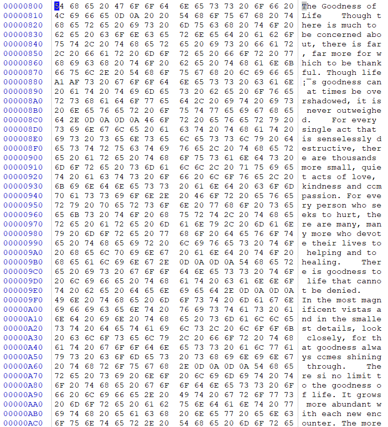
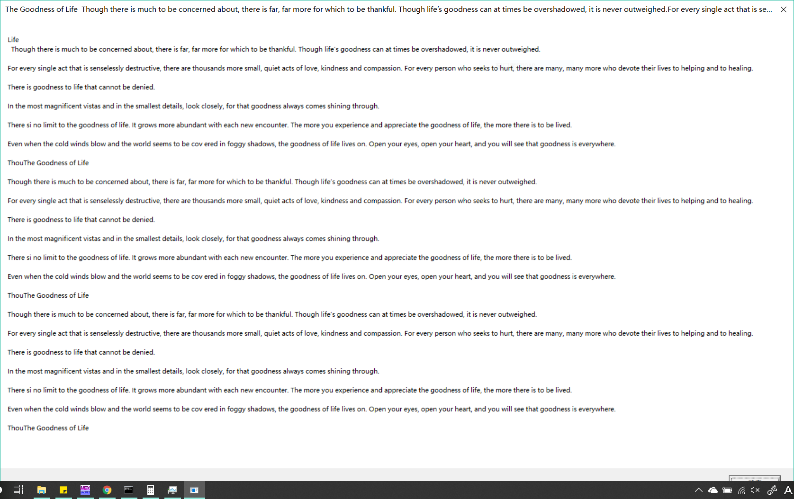

# 实验02
题目：上一题的程序中，修改的显示内容变为一个很长的字符串（至少2kb长）。并且保证程序正常运行不崩溃。

### 实验过程
* PE文件的结构如下，参照此结构在WinHex中打开hello.exe更改对应位置

* 未更改前文件内容如下

参照PE文件结构可以看出，.text段地址在00000400，大小为512bit，此段存储执行代码，与反汇编结果一致，如下图：

.data段地址在00000800，大小也为512bit,存储数据，如下图：

* 如果采用在二进制文件末尾增加内容的话，需要修改.text段中地址(划线)的部分，使其指向新增加的数据段地址，由于没有搞懂地址的对应关系，尝试失败。
* 采用直接在原数据段增加内容的方式，由于数据超过了2KB，需要更改数据段的大小，由200改为200000(256KB)

* 修改数据段内容

* 执行修改后的hello.exe文件

