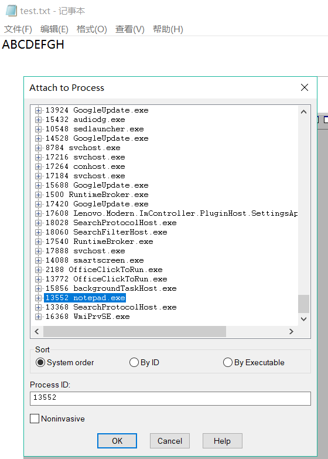
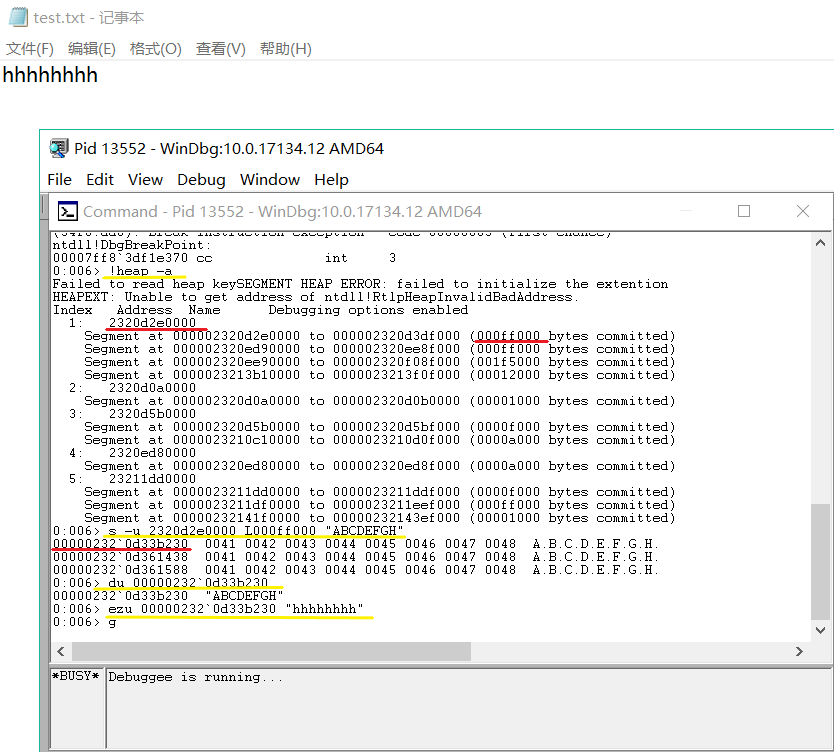

# 实验03
题目：在notepad（32位64位均可）中，输入一段文字。然后使用调试器，在内存中修改这段文字。使得没有在界面操作notepad的修改文字的情况下。notepad中显示的文字变化。

> 提示，在调试器中定位控件缓存的内存地址，可以用搜索、逆向、消息截获分析、API截获分析等方法。软件是数据和对数据的操作的集合。
软件安全就是研究软件的操作的具体过程、数据的具体形式，然后想办法获得、修改、破坏或者实施隐藏。又分为攻和防两个方面。
底层的软件，一次操作所能影响的数据少，操作的逻辑简单。
越到高层，一次操作所能影响的数据越多，操作的逻辑越复杂。
例如
指令 -> C语言语句 -> 函数 -> 对象
汇编 -> C -> C++ -> 各类脚本。
所以，我们进行软件攻防也有两种基本的方法。
hook 和 DKOM
hook，挂钩，即找到程序中的原有代码，并修改其代码，增加、减少或者篡改原用功能。达到授权破解（keygen）、作弊（游戏外挂）、隐藏（隐蔽攻击痕迹防止被防御软件查杀）等目的。
DKOM，直接内核对象操作。是一种典型的直接对程序内部数据的攻击。

### 实验过程
* 使用Windbg直接修改内存中的数据，找到存放字符串的内存地址，修改其中内容，然后让程序继续执行。
* 使用Windbg附加到notepad.exe进程。



* 列出已分配的所有堆，在其中查找字符串```"ABCDEFGH"```，对第一个内存位置的数据进行修改，然后让进程继续运行。



```txt
# 查看所有堆
!heap -a

# 查找字符串(在指定内存中)
s -u 2320d2e0000 L000ff000 "ABCDEFGH"

# 显示Unicode字符
du 00000232`0d33b230

# 修改字符串
ezu 00000232`0d33b230 "hhhhhhhh"

# 继续执行程序
g
```
* 记事本中的内容变为修改后的```"hhhhhhhh"```