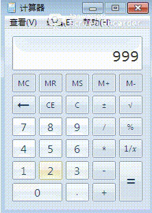

# 实验04
## 题目
### 4、通过调试器监控计算器程序的运行，每当运行结果为666时，就改为999。
提示：找到运行结果在内存中保存的地址。监控 “=” 按键消息等。
改导入表容易，IAT hook; 改代码，jmp 算指令
* 远程线程注入
* exe->API
  * 控件 SetWindowstextA/W 也调用了TextOut函数
  * 非控件 TextOutA/W
  * 屏幕取词其实是监控了TextOut函数(字符串、位置)
* 密码行
* cd C:\Windows\SysWoW64 
    * 这个目录下都是32位的，system32的是64位的 可以dumpbin查看headers中的 machine
* dumpbin /imports calc.exe > calc.txt
* 调用了SetWindowstextW函数
* windbg
  * 打开程序 
  * SHELL32.dll GDI32.dll
  * 下断点看输出
    * bp SetWindowstextW
    * 报错：不能解析 名称和地址的对应关系
    * 设置symbol file path (symbol-path for windows debugger 中找到dbgcmd) 不要用c盘 很大 勾选reload
    * 手工强制加载所有模块的符号文件 .reload /f /i

## 实验过程
配置符号表，windbg-> File -> symbol file path，内容如下，并勾选reload，保存。
```txt
.sympath cache*c:\MySymbols;srv*https://msdl.microsoft.com/download/symbols
```
强制加载符号表，在命令行中输入```.reload /f /i```

新建文本文件，命名为test.txt，存储在c盘，写入以下内容：
```txt
#新定义一个别名为name 将 poi（esp+0x8）处的 unicode字符串取出
as /mu ${/v:name} poi(esp+0x8)  

#进行字符串比较 如果name和666相同 就改为 999 否则输出name
.if($scmp(@"${name}","666")==0){ezu poi(esp+0x8) "999";}.else{.echo ${name};}

#程序继续运行
g
```
在windbg中打开calc.exe，输入指令```bp SetWindowTextW "$<C:\\test.txt"```，执行脚本，当计算器中显示为666时修改为999。



* 参考
[TheMasterOfMagic / SecurityOfSoftwareAndSystem](https://github.com/TheMasterOfMagic/SecurityOfSoftwareAndSystem/blob/master/4/4.md)