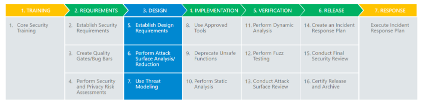
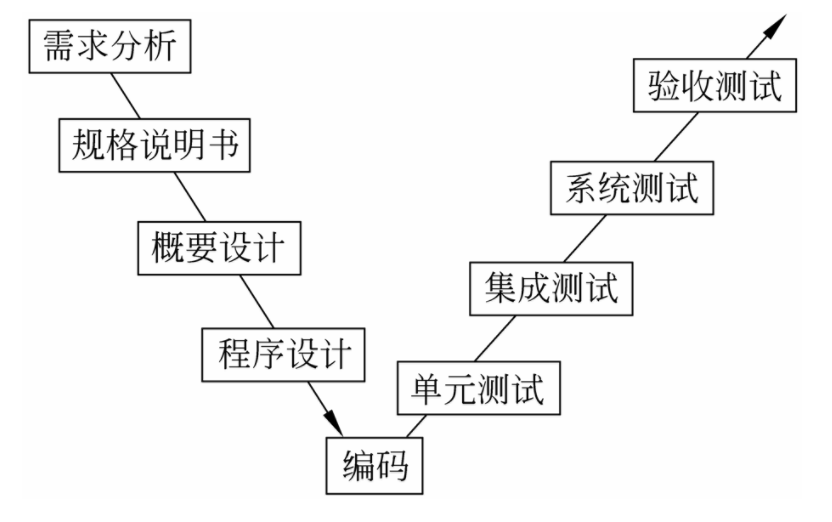
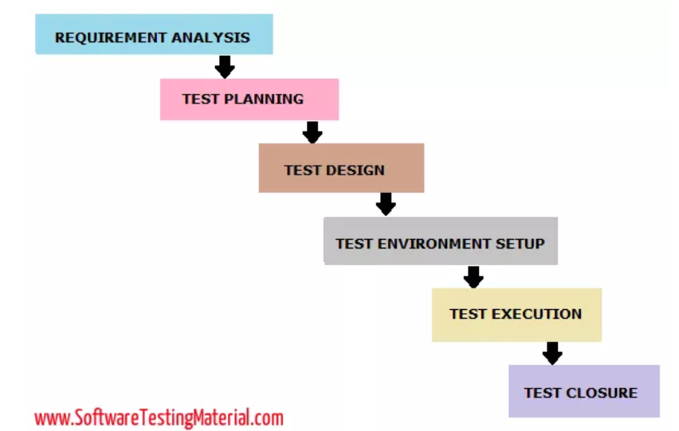

# 软件安全开发与软件测试技术

计算机软件是指在其运行的系统中相应程序和文档的总称，一般分为系统软件和应用软件两类，系统软件为计算机运行提供保障，主要是对计算机内部的硬件进行管理和协调，而应用软件是为了用户具体的应用需求，完成特定的用途。随着计算机软件日益广泛的应用，软件的安全问题不容忽视。软件安全问题产生的原因多种多样，在软件的开发阶段，开发者缺乏安全开发动机、相关的安全知识，或是缺乏安全开发的相关工具，都会造成潜在的安全问题；另一个威胁就是恶意攻击，一旦软件中有漏洞或是错误，很容易被黑客利用或是攻击；第三点是非法复制，即盗版软件的问题，某些不良分子为了短期内获得最大的经济效益，对计算机软件进行随意复制，不仅侵害了正版软件的知识产权，同时也对软件安全问题造成了严重的影响。实质上，要解决后两种问题主要还是在软件开发过程中要全面的考虑，减少漏洞和错误，加强安全意识和版权保护意识，从根本上对恶意攻击和复制进行防御。

在软件开发的阶段，为了解决软件安全问题，各大软件公司和专家提出了多种安全的软件开发模型，OWASP组织（Open Web Application Security Project，开放式Web应用程序安全项目）提出了CLASP综合轻量应用安全过程和SAMM软件保证成熟度模型等，微软也提出了可信计算安全开发生命周期SDL（Security Development Lifecycle，安全开发生命周期），SDL也是现在相对来说认可度较高的、适合大型企业大型软件开发的模型，此模型将软件生命周期分为5+2个阶段，每个阶段有相应必需的安全活动，如下图所示：



SDL最核心的概念是第一个阶段安全培训，软件是由设计人员设计，代码是由开发人员编写的，所以大部分软件本身的安全漏洞也是由设计和编码人员引入的，所以对技术人员进行安全培训至关重要。软件需求分析阶段，在考虑软件功能需求的同时，也要考虑系统的安全性，功能需求和安全需求要达到平衡，即不仅要从用户角度考虑功能，还要从攻击者的角度考虑威胁和漏洞。

下一个比较重要的阶段是软件安全设计，是指对于软件系统的每项需求，都应在设计阶段根据安全需求、风险评估以及具体的技术实现进行详细设计，包括但不限于安全体系结构设计、安全协议设计、安全接口设计、功能块间的处理流程设计、模块设计、数据结构、输入/输出项、逻辑流图、算法设计等。

SDL的安全设计核心原则有六条：
* Attack Surface Reduction 攻击面最小化
  * 攻击面指一个程序任何能被用户或其他程序访问到的部分，也是用户和恶意攻击者最可能攻击的部分。攻击面最小化就是尽量减少暴露给用户的攻击面的数量，安全人员在攻击面最小化是先要对攻击面进行分析，包括代码、接口、服务以及协议等，具体操作为：降低默认执行的代码量、降低代码执行所需的权限、限制可访问到代码的人员范围和身份。
* Basic Privacy 基本隐私
  * 用户在使用软件时，个人信息无可避免地被收集、使用甚至分发，企业有责任和义务保护用户个人信息，基本隐私是指只收集程序必须用到的隐私数据，并明确告知用户征得用户同意，微软对于用户隐私(口令、密码等) 需要加密存储的最低要求是sha256+salt，对于更高要求的则要使用PBKDF2算法加密。
* Least Privilege 权限最小化
  * 如果一个程序被恶意攻击，它的权限越小则造成的损害越小，因此安全设计人员在评估程序行为所需的最低权限和访问级别，合理分配权限。例如在Windows中，Office程序打开不可信来源的文档时，默认是不可编辑的，同时也默认不可执行代码，即使存在缓冲区溢出漏洞，也不会执行shellcode等恶意代码。 
* Secure Defaults 默认安全
  * 在客户熟悉安全配置选项之前默认安全配置，不仅有利于更好的帮助客户掌握安全配置经验，同时也可以确保应用程序初始状态下处于较安全状态。而客户可根据实际使用情况而决定应用程序安全与隐私的等级水平是否降低。例如，Win 7之后的Windows，DEP(数据执行保护)默认开启，用户可设置选项改变DEP的状态。
* Defense in Depth 纵深防御
  * 纵深防御是指从不同的层面、不同的角度对系统安全做出整体的解决方案。在Windows中，针对XSS（跨站脚本攻击）的防护，不仅要对用户输入的特殊符号进行过滤，而且要区分是否是富文本进而进行相应的编码操作，即在输入时过滤的同时在输出时也进行过滤操作。
* Threat Modeling 威胁建模
  * 此处的威胁是指恶意用户可能会试图利用以破坏系统，在设计阶段对威胁进行预测建模有利于威胁的解决以及后续的维护。SDL中使用STRIDE威胁建模，是由微软提出的一种威胁建模方法，将威胁类型分为Spoofing（仿冒）、Tampering（篡改）、Repudiation（抵赖）、Information Disclosure（信息泄漏）、Denial of Service（拒绝服务）和 Elevation of Privilege（权限提升），STRIDE威胁模型几乎可以涵盖目前绝大部分安全问题。

在代码层面，遵循安全编码原则，即代码的安全编译、代码安全审核、对所有输入数据进行检查、验证和过滤。另一个重要的板块是安全测试，除了对软件系统的软件测试外还要有转本的安全性测试，是对软件进行安全性的评估，而不是摧毁与破坏，常用的检测方式有模糊测试和渗透测试两种。
 
模糊测试也称Fuzz测试，通过提供非预期输入并监视异常结果来发现软件故障，强制软件程序使用恶意或破坏性的数据进行测试，观察出现的异常结果，不够健壮的程序会崩溃，利用大量的测试用例，查找漏洞或bug，是目前非常有效的漏洞挖掘技术，已知漏洞大部分都是通过这种技术发现的。

渗透测试是指通过模拟恶意攻击者进行攻击，来评估系统安全的评估方法，从攻击者的角度测试软件是否安全，通常使用自动化工具或人工的方法模拟攻击者的输入，找出运行时刻目标系统存在的安全漏洞，通过渗透测试找出来的问题都是比较严重的，但是渗透测试一般只能到达有限的测试点，覆盖率较低。

安全测试对测试人员还有一定的特殊需求，比如专业技术、知识储备和经验都很重要，还要像攻击者一样考虑安全问题，在安全测试的过程中，要做好系统备份、恢复措施和风险规避等方面的充分准备。图中的第六个阶段，即在软件发布后，增加了安全应急响应的活动，目前大多数公司已经具备了成熟的安全响应机制，还有安全编码规范、代码审计、渗透测试等安全活动也日趋成熟。

软件开发是根据用户的需求开发软件系统或部分软件的过程，软件测试则是促进软件的正确性、完整性、安全性和质量的过程，用于比较预期输出和实际输出之间的差异，保证软件性能，满足实际需求。软件测试是一系列工作的总称，是指在规定的条件下对程序进行操作，发现错误、衡量质量、评估是否能满足设计要求的过程，这个过程的对照目标就是软件系统的预期设计要求。软件测试的目标包括避免开发风险、降低常见风险以及了解软件性能，测试对象包括程序、数据和文档。

软件测试的流程有六个基本步骤：
* 拟定测试计划
  * 针对不同的对象目标进行分别拟定，例如测试对象为数据，则要了解数据在软件中能否被读取、执行，是否满足了系统上下限。 
* 挑选测试用例
  * 在软件测试中，尤其是大型软件，需要了解的项目较多，难以一一测试，因此要选择比较具有代表性的软件作为用例，用例要覆盖到关键性的测试需求，如主程序、核心参数等。 
* 启动测试计划
  * 在测试活动开始之前，需要对选定对象进行分析，判断其是否满足“启动准则”(EntryCriteria)，如果分析的结果理想，则启动测试，否则重复挑选测试用例的过程。 
* 提交缺陷问题
  * 在测试工作中，将测试结果与标准参数进行比对，了解其中的差异，明确问题以及缺陷，进行提交并且设法消除。 
* 设计优化调整
  * 完成缺陷问题的消除后，还要进行二次甚至三、四次测试，直到选定的测试目标在性能、参数上达到或高于设计标准，满足“完成准则”(ExitCriteria)，可以结束主体测试工作。 
* 提交测试成果
  * 撰写并提交测试报告，记录测试的核心参数用于接下来的实际工作。 

软件测试工作的V字流程图如下：



相对于SDL，也有软件测试生命周期Software Testing Life Cycle (STLC)，每个阶段都有明确的进入和退出标准(Entry and Exit Criteria)。



* Requirement Analysis 要求分析
  * 测试团队从测试角度研究和分析需求。此阶段有助于确定要求是否可测试。如果任何要求不可测试，测试团队可以在此阶段与各种利益相关者（客户，业务分析师，技术主管，系统架构师等）进行沟通，以便可以规划缓解策略。 
    * 准入标准：BRS(Business Requirement Specification，业务要求规范) 
    * 交付成果：所有可测试的要求清单，自动化可行性(Automation feasibility report )报告。
* Test Planning 测试计划
  * 测试计划是测试过程的第一步。在此阶段，测试经理/测试主管通常涉及确定整个项目的工作量和成本估算。测试计划的准备将根据需求分析完成。在此阶段执行的资源计划，确定角色和职责，工具选择（如果自动化），培训要求等活动。
    * 准入标准：需求文档(Requirements Documents)
    * 交付成果：测试策略，测试计划和测试成本评估文档(Test Strategy, Test Plan, and Test Effort estimation document)。 
* Test Design 测试设计
  * 测试团队在此阶段从测试用例开发活动开始。测试团队准备测试用例，测试脚本（如果自动化）和测试数据。一旦测试用例准备好，那么这些测试用例将由同行成员或团队负责人进行审核。此外，测试团队还准备了需求可跟踪性矩阵（RTM）。RTM跟踪验证是否满足要求所需的测试用例的要求。此阶段的可交付成果是测试用例，测试脚本，测试数据，需求可跟踪性矩阵.
    * 准入标准：需求文档(不清楚或缺少要求的最新版本)
    * 交付成果：测试用例，测试脚本（如果可以自动化），测试数据。
* Test Environment Setup 测试环境设置
  * 该阶段可以与测试设计阶段并行启动。测试环境设置基于硬件和软件需求列表完成。有些案例测试团队可能不参与此阶段。开发团队或客户提供测试环境。同时，测试团队应准备烟雾测试用例以检查给定测试环境的准备情况。
    * 准入标准：测试计划，烟雾测试(Smoke Test)案例，测试数据可
    * 交付成果：测试环境，烟雾测试结果。
* Test Execution 测试执行
  * 测试团队根据计划的测试用例开始执行测试用例。如果测试用例结果为Pass / Fail，则应在测试用例中更新相同的结果。应为失败的测试用例准备缺陷报告，并应通过错误跟踪工具（例如，质量中心）向开发团队报告以修复缺陷。一旦缺陷得到修复，将进行重新测试。
    * 准入标准：测试计划文档，测试用例，测试数据，测试环境。
    * 交付成果：测试用例执行报告，缺陷报告，RTM(Requirements Traceability Matrix，需求可跟踪性矩阵 )
* Test Closure 测试结束
  * 准备测试结束报告，测试指标的最后阶段。将召集测试团队召开会议，根据测试覆盖率，质量，时间，成本，软件，业务目标评估周期完成标准。测试团队分析测试工件（例如测试用例，缺陷报告等），以确定将来必须实施的策略，这将有助于消除即将到来的项目中的流程瓶颈。将根据上述标准准备测试指标和测试结束报告。
    * 准入标准：测试用例执行报告（确保没有高严重性缺陷），缺陷报告。
    * 交付成果：测试结束报告，测试指标。


测试级别有以下四种：
* 单元测试
  * 对程序中的某个接口或者模块进行测试，一开始的时候不是对整个程序进行测试，而是先将注意力集中在构成整个程序的各个小单元的测试上，单元测试的目的是开发人员确定这段子程序做了它应该做的事。
* 集成测试
  * 集成测试是单元测试的逻辑扩展，最简单的形式是：两个已经测试过的单元组合成一个组件，并且测试它们之间的接口。集成测试的目的是测试各个组件间是否能互相配合，正常工作。为了看代码是否按"设计或期望的方式"工作。
* 系统测试
  * 是将经过测试的子系统装配成一个完整系统来测试。它是检验系统是否确实能提供系统方案说明书中指定功能的有效方法。系统测试的目的是对最终软件系统进行全面的测试，确保最终软件系统满足产品需求并且遵循系统设计。
* 验收测试
  *  一般根据产品规格说明书严格检查产品，详细对照说明书上对软件产品所做出的各方面要求，确保所开发的软件产品符合用户的各项要求。验收测试方法有α测试和β测试。α测试是由一个用户在开发环境下进行的测试，也可以是公司内部的用户在模拟实际操作环境下进行的测试。经过α测试调整的软件产品称为β版本。β测试由软件的最终用户们在多个环境进行，与α测试不同，开发者一般不在β测试的现场，所以β测试是软件在开发者不能控制的环境中的“真实”应用。

软件测试的类型可分为两种：
* 手动测试
  * 手动测试是手动测试软件以发现缺陷的过程。测试人员应该具有最终用户的视角，并确保所有功能都按照需求文档中的说明进行操作。在此过程中，测试人员执行测试用例并手动生成报告，而无需使用任何自动化工具。
* 自动化测试
  * 自动化测试是使用自动化工具测试软件以查找缺陷的过程。在此过程中，测试人员执行测试脚本并使用自动化工具自动生成测试结果。常用的功能测试自动化测试工具有QTP/UFT和Selenium。

软件测试的方法一般分为黑盒测试和白盒测试：
* 黑盒测试
  * 它也被称为基于行为/规范/输入输出测试，测试人员在不考虑内部代码结构的情况下评估测试软件的功能。可以应用于各个级别的软件测试，例如单元，集成，系统和验收测试。测试人员根据软件要求和规范创建测试场景/案例。测试程序仅对应用程序的功能部分执行测试，以确保软件的行为符合预期。测试者传递输入数据以确定实际输出是否与预期输出匹配。
  * 黑盒测试技术
    * 等价划分
      * 在等价划分中，对软件或系统的输入被分成预期表现出类似行为的组，因此可能以相同的方式提出它们。因此，从每个组中选择一个输入来设计测试用例。
    * 边界值分析
      * 边界值分析（BVA）基于测试有效和无效分区的边界值。每个等价分区边缘的行为比分区内的行为更可能不正确，因此边界是测试可能产生缺陷的区域。
    * 决策表
      * 决策表又名因果表。此测试技术适用于在输入（if-else逻辑）之间具有逻辑关系的功能。在决策表技术中，我们处理输入的组合。为了使用决策表识别测试用例，要考虑条件和操作，将条件作为输入和行动作为输出。
    * 状态转换
      * 使用状态转换测试时，从需要测试不同系统转换的应用程序中选择测试用例。当应用程序为同一输入提供不同的输出时，我们可以应用此功能，具体取决于先前状态中发生的情况。
 * 黑盒测试类型
   * 功能检测
   * 非功能检测

* 白盒测试
  * 也称为透明测试、结构测试。白盒测试基于应用程序内部代码结构。在白盒测试中，系统的内部视角以及编程技巧用于设计测试用例。此测试通常在单元级别完成。
  * 白盒测试技术
    * 声明范围
    * 分支机构
    * 路径覆盖范围

上文中在SDL中提到的安全测试也属于软件测试，是非功能性检测，目的是找出系统在启动阶段本身存在的所有漏洞和弱点，避免系统性能不一致、以外故障、信息丢失、收入和客户信任损失。
安全测试包括以下基本安全属性：
1. Authentication 认证性
2. Authorization 授权性
3. Availability 可用性
4. Confidentiality 机密性
5. Integrity 完整性
6. Non-repudiation 不可否认性

目前比较常见的再安全检测中出现的漏洞有：
* SQL Injection SQL注入
  * 注入攻击漏洞往往是应用程序缺少对输入进行安全性检查所引起的。攻击者把一些包含攻击代码当做命令或者查询语句发送给解释器，这些恶意数据可以欺骗解释器，从而执行计划外的命令或者未授权访问数据。 
* Cross-Site Scripting (XSS) 跨站点脚本攻击
  * XSS的出现时间跟SQL差不多，是最普遍的web应用安全漏洞。当应用程序在发送给浏览器的页面中包含用户提供的数据，但没有经过适当验证或转译，就会导致跨站脚本漏洞。XSS允许攻击者在受害者的浏览器中执行脚本，这些脚本可以劫持用户会话，破坏网站，或将用户重定向到恶意站点。 
* Session Management 会话管理攻击
  * 当用户不操作时，系统必须自动终止超时会话，必须有时间限制；必须提供退出功能，允许用户强制退出会话；会话标识足够随机，防止攻击者猜测到标识；用户登录后必须分配新的会话标识，不使用用户未登录前所使用的标识，防止会话攻击。 
* Broken Authentication 身份认证中断
  * 与认证和会话管理相关的应用程序功能往往得不到正确管理，这就导致攻击者破坏密码、密匙、会话令牌或利用实施漏洞冒充其他用户身份。
* Cross-Site Request Forgery (CSRF) 跨站请求伪造
  * 利用了网站允许攻击者预测特定操作的所有细节这一特点。由于浏览器自动发送会话cookie等认证凭证，导致攻击者能够创建恶意的web页面来伪造请求。这些伪造的请求很难和合法的请求区分开。CSRF通过伪装来自受信任用户的请求来利用受信任的网站。
* Security Misconfiguration 安全配置错误
  * 良好的安全性需要为应用程序、框架、应用服务器、web服务器、数据库服务器和平台定义和部署安全配置。默认值通常是不安全的。另外，软件应该保持更新。攻击者通过访问默认账户、未使用的网页、未安装补丁的漏洞、未被保护的文件和目录等，以获得对系统未授权的访问。 
* Sensitive Data Exposure 敏感信息泄露
  * 保护与加密敏感数据已经成为网络应用的最重要的组成部分。最常见的漏洞是应该进行加密的数据没有进行加密。使用加密的情况下常见问题是不安全的密钥和使用弱算法加密。
* Insecure Direct Object Reference 不安全的直接对象引用
  * 当开发人员公开对内部实现对象(如文件、目录或数据库键)的引用时，就会出现直接对象引用。如果没有访问控制检查或其他保护，攻击者可以操纵这些引用来访问未经授权的数据。 
* Failure to Restrict URL Access 无法限制URL访问
* Missing Function Level Access Control 缺少功能级访问控制
* Using Components with Known Vulnerabilities 使用具有已知漏洞的组件
* Unvalidated Redirects and Forwards 未经验证的重定向和转发

安全测试主要有以下几种类型/方法：
* Vulnerability Scanning 漏洞扫描
  * 在漏洞扫描（又称漏洞评估）中，我们只使用漏洞扫描工具识别并报告漏洞。这是提高系统安全性的第一步。漏洞评估报告应包含漏洞的标题，描述和严重性。
* Security Scanning 安全扫描
  * 进行安全扫描以发现网络和系统安全性的弱点，并提供降低这些风险的解决方案。
* Penetration Testing 渗透测试
  * 在Penetration测试（又名Pen测试）中，识别漏洞并尝试使用渗透测试工具来利用它们。重复相同的渗透测试，直到系统对所有这些测试都是否定的。Pen测试可分为三种技术，如手动渗透测试，自动渗透测试以及手动和自动渗透测试的组合。
* Risk Assessment 风险评估
  * 风险评估涉及审查和分析安全风险，以后将优先考虑低，中和高。它还建议了可能的方法来预防风险。
* Security Auditing 安全审计
  * 安全审计是定义安全漏洞的过程。这是对系统的内部检查，以发现安全漏洞。在某些情况下，通过逐行检查代码进行审核。
* Ethical Hacking 道德黑客攻击
  * 道德黑客指一群专门模拟黑客攻击，帮助客户了解自己网络的弱点，并为客户提出改进建议的网络安全专家。道德黑客攻击是在系统上完成的，旨在查找和揭示系统中的安全问题。道德黑客攻击由白帽黑客完成。白帽黑客是一名安全专业人员，他以合法的方式使用他们的技能来揭示系统的缺陷。
* Posture Assessment 态势评估
  * 态势评估是安全扫描，道德黑客攻击和风险评估的组合，用于表示系统或组织的安全状况。

软件测试是在软件投入运行前对软件需求分析、规格说明和编码的最终审查，是软件质量保证的关键步骤，传统的软件测试通常是有专业的测试人员进行测试用例的编写、执行、分析等各项工作，但随着软件系统越来越复杂，传统的手工测试从长远来看成本高、耗时长，适用于短生命周期、需求经常变化的应用程序，相比于人工测试，自动化测试执行速度更快、测试结果更可靠、功能更强大，适用于稳定的较大型的软件系统，但是也有其局限性，比如处理验证码、字体、颜色不是很方便，如果需求发生反复的变化，需要进行大量的维护，而且并非所有工具都支持各种测试。现在常采用人工测试和自动化测试相结合的方法，越来越多的自动化测试工具来复制技术人员来完成软件的测试工作。

由于自动化测试还处于辅助测试阶段，不能独立的完成某一部分的测试流程，随着人工智能的发展，希望引入人工智能的相关技术来帮助软件测试实现更好的自动化。比如使用机器学习的方法，由测试人员提供大量的输入和输出数据来训练AI，最终由AI学会根据特定的需求去自动生成大量的测试用例并执行测试，可以对测试结果进行分析，将大大减少人工测试的工作量，提高工作效率。在软件性能测试的方面，由于性能测试一般是大数据量的反复、长期测试，人工审查方面时难免会出现错误。结合人工智能的图像识别与AI训练技术能够更好的监控和记录的测试过程中的数据、表格及图像，而且能快速的分析软件中所存在的性能问题以及程序缺陷。因此，目前人工智能已经在性能测试方面有了较多应用，如腾讯的 UPA（Unity PerformanceAnalysis），就是一运用人工智能中图像识别技术以及深度学习技术的性能优化工具。目前人工智能已经在软件测试的某些特定领域有了实际的应用，比如游戏测试、兼容性测试等，由于强人工智能发展的阶段还不高并且人工智能的测试成本较高，目前还没有到非常成熟的阶段，但随着软件测试的需求变化以及技术发展，人工智能技术的参与是一个很有前景的新方向，也是软件安全开发及其测试技术的推动力。


* 参考资料：
``` txt
[1]曹为政. 计算机软件安全问题的分析及其防御策略研究[J]. 中国新通信, 2018, 卷缺失(17): 158.
[2]吴文庆,修雅慧. 软件测试在软件开发中应用的探讨[J]. 职业技术, 2018, 卷缺失(11): 83-85.
[3]任子恒,李昕昕,龚勋. 人工智能在软件测试上的应用与挑战[J]. 电脑知识与技术, 2018, 卷缺失(29): 218-219.
[4]张萍,田闯,李卫. 软件开发过程中的信息安全管理[J]. 中国信息化, 2018, 卷缺失(11): 63-64.
[5]https://www.microsoft.com/en-us/securityengineering/sdl/practices
[6]https://www.softwaretestingmaterial.com/software-testing/
```